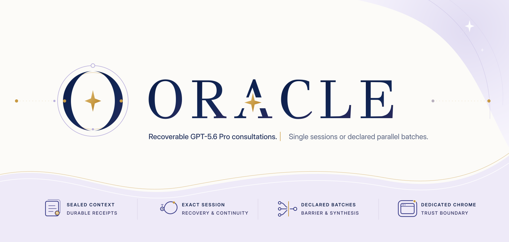

<!-- readme-sync:language -->
<p align="right">
  <strong>简体中文</strong> · <a href="./README.en.md">English</a>
</p>

<p align="center">
  
</p>

<!-- readme-sync:identity -->

# Oracle / IndelibleVivi fork

> 可恢复的 GPT-5.6 Pro 咨询：单会话，或声明式并行批次。

高成本 Pro 运行不适合寄托在一张脆弱的浏览器标签页上。这个公开 fork 将选定的上下文、提交收据、会话身份、回答、产物和恢复 lineage 持久化在 Oracle session 中；canonical browser lane 经由独立的 Chrome for Testing profile 与 loopback CDP 进入 ChatGPT。

Oracle 负责 prompt bundle、browser action、session truth、恢复和 follow-up lineage。人负责首次登录、真实账户挑战，以及 Batch Oracle 中需要明确记录的 owner decision。OpenCLI 保留为普通咨询的显式替代 transport，不会自动接管失败的 CDP 运行。

`GPT-5.6 Pro` 是当前的人类可读目标。CLI 使用稳定别名 `gpt-5-pro`，并在提交标签页中选择和核验当前的 GPT-5.6 Sol + Pro 组合。

→ [阅读双语公开发布说明：为什么每一次 Pro consultation 都该有一条回来的路](./LAUNCH.md)

<!-- readme-sync:modes -->

## 两条主要路径

| 路径         | 适合什么                           | Oracle 持久化什么                                                                   |
| ------------ | ---------------------------------- | ----------------------------------------------------------------------------------- |
| 单会话咨询   | 一项复杂审查、研究或架构问题       | dispatch、conversation、answer、artifacts、follow-up 与恢复状态                     |
| Batch Oracle | 同一决策中至少两项可独立审查的问题 | sealed source snapshot、并行 blind lanes、barrier、owner decisions 与可选 synthesis |

Batch Oracle 的 lane 按职责拆分，不做同题投票。所有第一阶段输入先整体密封，再在本机与账户容量允许的范围内并行 dispatch；synthesis 只有在 barrier 关闭后才可能启动。

<!-- readme-sync:quickstart -->

## 快速开始

> Homebrew 与 npm 上发布的 Oracle package 来自上游仓库，不包含这个 fork 的改动。请从源码安装本仓库。

要求：Node.js 24 或更新版本，以及能够访问目标模型与 reasoning tier 的 ChatGPT 账户。

```bash
git clone https://github.com/IndelibleVivi/oracle.git
cd oracle
corepack enable
pnpm install
pnpm build
npm link
```

安装官方 Chrome for Testing，并为 Oracle 建立独立浏览器身份：

```bash
oracle browser install
oracle browser setup --use-mock-keychain
oracle browser smoke
```

`setup` 只用于首次人工登录，不开放 CDP endpoint。关闭整个 Chrome for Testing 后命令才会返回。`smoke` 会执行两次真实冷启动，核验登录持久化、composer readiness、exact-target cleanup 与 endpoint shutdown，全程不提交 prompt。

在 macOS 上，`--use-mock-keychain` 是显式 unattended-mode tradeoff。它避免独立 profile 反复请求日常 Chrome Safe Storage，同时降低该 profile 的静态 cookie 保护强度；请保持目录 owner-only，并只用于 ChatGPT。

<!-- readme-sync:single-session -->

## 运行一次普通咨询

```bash
oracle --engine browser \
  --model gpt-5-pro \
  -p "Audit this change for correctness and missing tests." \
  --file "src/**"
```

长运行会保留为可恢复 session。Pro 暂时安静时，不要另起一份重复咨询；先读取或 reattach 已有 session：

```bash
oracle status --hours 72
oracle session <session-id> --render
oracle --followup <session-id> \
  -p "Challenge the previous recommendation and return the final decision."
```

Oracle 会记录已提交 turn 的 identity 与 timing evidence。恢复必须回到原 conversation；只有 durable receipt 明确证明 prompt 尚未提交、尚未 commit 且 `retrySafe:true` 时，显式 resume 才能创建新 attempt。

<!-- readme-sync:batch -->

## Batch Oracle

Batch Oracle 适合把一项复杂决策拆成不同职责的独立审查 lane，例如 product constitution、security、human cognition 与 adversarial tribunal。它保留各 lane 的原始回答和分歧，之后可由 host 直接整合，也可配置 contradiction-first synthesis。

```bash
oracle batch validate batch.json5
oracle batch run batch.json5
oracle batch status <batch-id> --json
oracle batch resume <batch-id>
oracle batch accept-missing <batch-id> --lane <lane-id> --reason "<owner reason>"
oracle batch resume <batch-id> --allow-partial
oracle batch accept-missing <batch-id> --synthesis --reason "<owner reason>"
oracle batch render <batch-id> --all
```

第一阶段 lane 的缺失、以及已提交但长期不可恢复的 synthesis，都需要 owner 以 durable decision 明确关闭。Oracle 不会静默接受缺失，也不会用新 prompt 替换已 commit 的 conversation。普通 field use 通常采用两到三条独立 lane；配置式 Pro synthesis 保持可选。

完整 manifest、状态机、恢复矩阵、bundle identity 与 v1 边界见 [Batch Oracle v1](docs/batch-oracle.md)。

<!-- readme-sync:browser -->

## 为什么使用独立 Chrome

这个 fork 的 canonical lane 同时使用两层隔离：

- Chrome for Testing 提供与日常 Chrome 不同的 app identity；
- `~/.oracle/browser-profile` 提供 Oracle 专用的持久化 user-data directory。

普通运行只在 `127.0.0.1` 上开放 CDP，并以 exact target ID 管理自己创建的页面。Oracle 不会把 launcher 指向默认个人 Chrome profile，也不会依赖每次连接日常浏览器时出现的 Allow dialog。

完整 lifecycle、privacy 与 verification contract 见 [Dedicated Chrome transport](docs/dedicated-chrome.md)。

<!-- readme-sync:trust -->

## Trust boundary

| 边界               | Authority          | Contract                                                         |
| ------------------ | ------------------ | ---------------------------------------------------------------- |
| Prompt 与选定文件  | Oracle             | 本地组装，只发送明确选择的 context                               |
| Session truth      | Oracle             | 持久化 dispatch、conversation、answer、artifacts 与 lineage      |
| Browser process    | Oracle             | 启动独立 profile，只绑定 loopback CDP，并清理 exact owned target |
| App identity       | Chrome for Testing | 不把 Oracle 进程注册成日常 Chrome                                |
| Browser data       | Dedicated profile  | 将 ChatGPT 登录状态与个人浏览、其他账户分离                      |
| Account 与缺失决策 | Human owner        | 完成首次登录、真实挑战和显式 owner closure                       |

<!-- readme-sync:scope -->

## 当前 fork 范围

| 能力                      | Dedicated CDP |  OpenCLI alternative |
| ------------------------- | ------------: | -------------------: |
| GPT-5.6 Pro 文本咨询      |           Yes |                  Yes |
| 持久化隔离登录            |           Yes | Browser Bridge-owned |
| 恢复且不重复提交          |           Yes |                  Yes |
| Oracle follow-up lineage  |           Yes |                  Yes |
| Deep Research             |           Yes |  No；dispatch 前拒绝 |
| 图像生成与下载            |           Yes |  No；dispatch 前拒绝 |
| Batch Oracle v1           |           Yes |                   No |
| 自动跨 transport fallback |         Never |                Never |

Attach-running personal Chrome、remote Chrome、API、MCP 与 render path 仍作为独立显式模式存在。它们的边界见 [Browser Mode](docs/browser-mode.md)。

<!-- readme-sync:docs -->

## 文档入口

| 从这里开始                                                                      | 内容                                                                        |
| ------------------------------------------------------------------------------- | --------------------------------------------------------------------------- |
| [Dedicated Chrome transport](docs/dedicated-chrome.md)                          | canonical topology、setup、lifecycle、privacy 与 verification               |
| [Batch Oracle v1](docs/batch-oracle.md)                                         | parallel-first manifest、sealing、barrier、synthesis、recovery 与 rendering |
| [Quickstart](docs/quickstart.md)                                                | 首次登录、smoke、第一次咨询、render 与 reattach                             |
| [Browser Mode](docs/browser-mode.md)                                            | direct CDP、attach-running、remote Chrome、OpenCLI、Deep Research 与 images |
| [OpenCLI alternative](docs/opencli-transport.md)                                | sealed bridge handoff 与 waiter-only recovery                               |
| [Coding Agents](docs/agents.md)                                                 | Codex、Claude Code、Cursor、CLI 与 MCP 使用方式                             |
| [Sessions](docs/sessions.md) · [Follow-ups](docs/followup.md)                   | durable runs 与 conversation lineage                                        |
| [Configuration](docs/configuration.md) · [CLI reference](docs/cli-reference.md) | 配置优先级、flags 与 limits                                                 |

<!-- readme-sync:development -->

## 开发与验证

```bash
pnpm install
pnpm check
pnpm test
pnpm build
pnpm docs:check
pnpm test:packed-cli
```

`oracle browser smoke` 是 account-safe 的 live transport test：它会冷启动两次，并且不会创建 ChatGPT conversation。

<!-- readme-sync:provenance -->

## Provenance 与许可

这是 [steipete/oracle](https://github.com/steipete/oracle) 的公开 fork，保留上游 Git history 与 MIT license。独立 Chrome 默认路径、fork 的 Pro timing / receipt contract、OpenCLI alternative，以及 Batch Oracle 属于本 fork 的实现与维护范围；这里不是上游 release，也不是 OpenAI product。

MIT。见 [LICENSE](LICENSE)。
