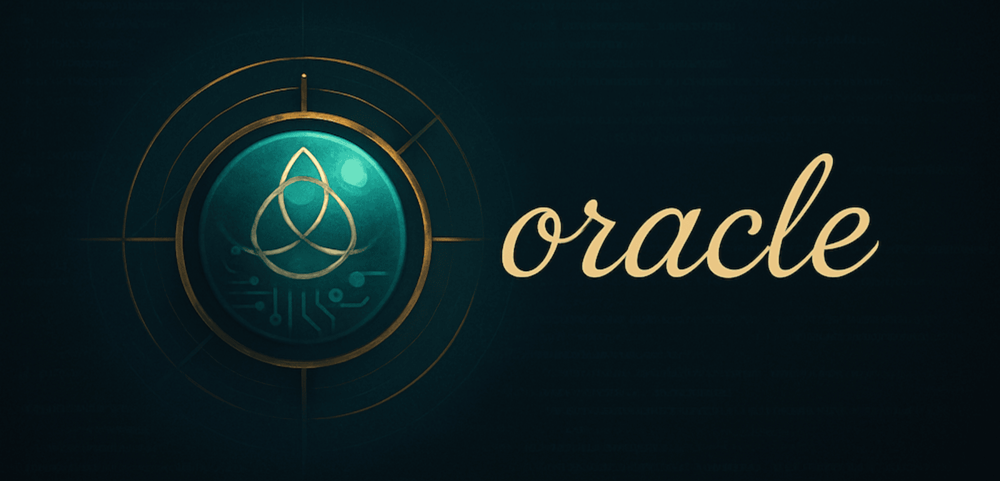

# Oracle × OpenCLI 🧿

<p align="center">
  
</p>

<p align="center">
  <a href="https://github.com/IndelibleVivi/oracle/actions/workflows/ci.yml"></a>
  
  
  
  <a href="LICENSE"></a>
</p>

**A recoverable, unattended browser path from coding agents to ChatGPT GPT-5.6 Pro.**

This public fork keeps [Oracle](https://github.com/steipete/oracle) in charge of
the work that makes a second-model consultation trustworthy—bundle assembly,
authorization, sessions, transcripts, follow-up lineage, and recovery—while
delegating only the authenticated browser boundary to
[OpenCLI](https://github.com/jackwener/opencli). Routine Chrome debugging
approval is no longer part of the happy path.

The point is not merely fewer clicks. It is preserving **one canonical session
authority** while making long GPT-5.6 Pro consultations able to finish when the
operator is away from the computer.

## The design

| Boundary          | Owner   | Contract                                                                                                 |
| ----------------- | ------- | -------------------------------------------------------------------------------------------------------- |
| Prompt and files  | Oracle  | Assemble locally, preview when needed, then seal the exact authorized turn.                              |
| Session truth     | Oracle  | Persist submission state, conversation receipt, answer, transcript, and follow-up lineage.               |
| Browser access    | OpenCLI | Use the authenticated Browser Bridge, select `Pro`, submit sealed files, and return structured evidence. |
| Account decisions | Human   | Sign in, resolve challenges, and choose when private material may be sent.                               |

```text
coding agent / human
        │  prompt + selected files
        ▼
Oracle ── seal turn ── persist intent ── own session + recovery
        │
        │  mode-0600 payload + versioned manifest
        ▼
OpenCLI Browser Bridge ── authenticated tab lease ── ChatGPT GPT-5.6 Pro
        │                                                │
        └──── structured receipt + read-only detail ─────┘
```

A sidecar wrapper would look smaller, but it would also become a second session
engine: conversation references, retries, follow-ups, and provenance would be
split between two tools. This fork instead adds one thin
`OpenCliBrowserTransport` inside Oracle. The transport is replaceable; Oracle's
record remains canonical.

Read the complete rationale and failure contract in
[Why the OpenCLI transport lives inside Oracle](docs/opencli-transport.md).

## Install this fork

The published npm and Homebrew packages are upstream Oracle and do not include
this transport yet. Install the fork from source together with its companion
OpenCLI adapter:

```bash
git clone https://github.com/IndelibleVivi/oracle.git
cd oracle
corepack enable
pnpm install
pnpm build
pnpm link -g
node scripts/install-opencli-submit-file-adapter.mjs
opencli validate chatgpt/submit-file
```

Requirements:

- Node.js 24 or newer.
- OpenCLI 1.8.3 or newer in the 1.x line.
- An authenticated OpenCLI Browser Bridge.
- ChatGPT account access to the current Pro tier.

Run a preflight without sending private content:

```bash
opencli doctor
opencli validate chatgpt/submit-file
oracle --dry-run summary --files-report \
  --engine browser \
  --browser-transport opencli \
  --model gpt-5-pro \
  -p "Audit this change for correctness and missing tests." \
  --file "src/**"
```

Then remove `--dry-run summary` to dispatch the sealed turn. To make OpenCLI the
default browser transport, add this to `~/.oracle/config.json`:

```json
{
  "engine": "browser",
  "model": "gpt-5-pro",
  "browser": {
    "transport": "opencli",
    "modelStrategy": "select"
  }
}
```

Long GPT-5.6 Pro answers remain recoverable Oracle sessions:

```bash
oracle status --hours 72
oracle session <session-id> --render
oracle --followup <session-id> \
  -p "Challenge the previous recommendation and return the final decision."
```

## The GPT-5.6 Pro naming contract

There are three names here because product language and browser automation have
different stability requirements:

| Layer                         | Name            | Why                                                                                                        |
| ----------------------------- | --------------- | ---------------------------------------------------------------------------------------------------------- |
| Human-facing product          | **GPT-5.6 Pro** | Names the current ChatGPT Pro experience this fork targets.                                                |
| Oracle browser alias          | `gpt-5-pro`     | A stable CLI alias that follows the current Pro picker target. It is not an OpenAI API model ID.           |
| ChatGPT/OpenCLI wire evidence | `Pro` / `pro`   | The current composer label and OpenCLI enum. Exact UI-native evidence must not be rewritten after capture. |

`gpt-5.5-pro` remains Oracle's upstream API model/default and is intentionally
not mass-renamed. Likewise, API reasoning mode for GPT-5.6 remains a separate
provider contract. This fork's GPT-5.6 Pro label describes the browser lane.

## What “unattended” means

Unattended means the normal consult does not stop for Chrome's local debugging
approval. It does **not** mean bypassing account controls or pretending browser
automation can never need a person.

Before submission, Oracle verifies the OpenCLI version, Browser Bridge, adapter
contract, target host, selected `Pro` state, and sealed artifact identity. Prompt
and file contents are passed through mode-`0600` session artifacts rather than
shell arguments. Model selection and submission share one Oracle-owned lock.

After submission, Oracle records the conversation receipt before harvesting the
answer through read-only `chatgpt detail`. If a receipt exists, recovery retries
detail only and never silently sends the turn twice. If submission may have
happened but no durable receipt exists, Oracle marks the attempt ambiguous
instead of guessing. There is no silent fallback to direct CDP.

Human attention can still be required for first-time sign-in, expired sessions,
account challenges, model entitlement, or an OpenCLI/ChatGPT contract change.

## Current fork scope

| Capability                            | OpenCLI transport         |
| ------------------------------------- | ------------------------- |
| New GPT-5.6 Pro text consult          | Yes                       |
| Sealed files and prompt               | Yes                       |
| Durable conversation receipt          | Yes                       |
| Answer recovery without resubmission  | Yes                       |
| Oracle `--followup` lineage           | Yes                       |
| Same-invocation `--browser-follow-up` | Not yet; use `--followup` |
| Deep Research                         | No; fails before dispatch |
| Image generation                      | No; fails before dispatch |
| Silent fallback to CDP                | Never                     |

The legacy CDP, attach-running, Gemini web, API, MCP, and render paths remain
available when selected explicitly. See [Browser Mode](docs/browser-mode.md) for
their separate setup and trust boundaries.

## Upstream Oracle

Oracle is a CLI and MCP server that bundles a prompt with selected files, sends
that context through an API or signed-in browser, and stores the result as a
session. The upstream distribution supports OpenAI, Azure OpenAI, Anthropic,
Gemini, xAI, OpenRouter, compatible endpoints, direct Chrome automation, and a
manual `--render --copy` fallback.

Upstream packages:

```bash
brew install steipete/tap/oracle
npm install -g @steipete/oracle
npx -y @steipete/oracle --help
```

Those commands install [steipete/oracle](https://github.com/steipete/oracle),
not this fork's OpenCLI transport. Full upstream documentation is at
[askoracle.sh](https://askoracle.sh).

## Documentation

| Start here                                                                      | Deeper reference                                           |
| ------------------------------------------------------------------------------- | ---------------------------------------------------------- |
| [OpenCLI transport design](docs/opencli-transport.md)                           | Ownership, state machine, recovery, privacy, and non-goals |
| [Browser Mode](docs/browser-mode.md)                                            | OpenCLI setup plus explicit legacy browser paths           |
| [Quickstart](docs/quickstart.md)                                                | First fork run, API path, render path, and reattach        |
| [Coding Agents](docs/agents.md)                                                 | Codex, Claude Code, Cursor, CLI, and MCP patterns          |
| [Sessions](docs/sessions.md) · [Follow-ups](docs/followup.md)                   | Durable runs and conversation lineage                      |
| [Configuration](docs/configuration.md) · [CLI reference](docs/cli-reference.md) | Flags, config precedence, and limits                       |

## Development

```bash
pnpm install
pnpm check
pnpm test
pnpm build
pnpm docs:check
```

The narrow OpenCLI contract tests exercise a sealed new turn, an explicit
stored-conversation follow-up, and detail-only recovery without touching a real
account. Manual browser/provider checks remain documented in
[docs/manual-tests.md](docs/manual-tests.md).

## Provenance and license

This is a public fork of [steipete/oracle](https://github.com/steipete/oracle),
preserving upstream history and MIT licensing. The OpenCLI transport is an
independent fork feature and is not an upstream release or an OpenAI product.

MIT. See [LICENSE](LICENSE).
