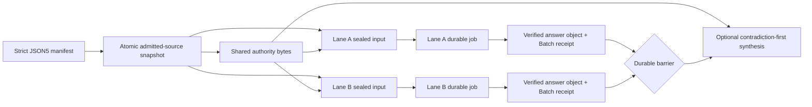

# Parallel consultation without rolling consensus

Batch Oracle is for one difficult decision that contains at least two
independent, decision-relevant questions. Each question becomes a declared
lane with its own mandate, falsification target, evidence, exact prompt, output
contract, and recoverable Oracle v2 job. Oracle seals the complete first-stage
ready set before sending anything, admits those lanes concurrently up to the
owner's configured client cap, and keeps sibling answers hidden while the
stage is open. The separately running worker owns browser execution, serializes
Send preparation/dispatch globally, and captures at most three jobs at once.
Recoverable work keeps the barrier open until its original job is resumed or
reaches a terminal state.

An optional synthesis lane starts only after the first-stage barrier closes. It
receives the raw answers and their provenance together, preserves dissent, and
adjudicates contradictions. Batch Oracle is not identical-prompt voting, a
persona panel, rolling synthesis, or an arbitrary workflow DAG.



## Manifest

Batch manifests are strict JSON or JSON5. Unknown fields, unsupported schema
versions, unsafe paths, lane ID collisions, exact normalized prompt duplicates,
and prompt/files/mandate duplicates fail validation. A batch requires at least
two first-stage lanes.

```json5
{
  schemaVersion: "oracle.batch.v1",
  slug: "release-readiness-tribunal",
  project: "example",
  objective: "Decide whether the release candidate is ready and identify one bounded next experiment.",
  cwd: ".",
  sharedAuthority: {
    revisionLabel: "release-candidate-4",
    files: ["docs/product-contract.md", "docs/release-criteria.md"],
  },
  policy: {
    maxParallel: 3,
    maxChildSessions: 4,
    allowanceGate: "pause-batch",
    partialSynthesis: "owner-explicit",
    revealLaneAnswersBeforeBarrier: false,
  },
  lanes: [
    {
      id: "contract",
      title: "Product contract",
      mandate: "Test the candidate against the declared user job and boundaries.",
      whyThisLane: "Feature completeness is independent from runtime reliability.",
      falsificationTarget: "The candidate can pass implementation checks while missing the declared job.",
      prompt: "Audit the release candidate against the product contract.",
      files: ["src/product/**", "tests/product/**"],
      bundleRole: "sources",
      outputContract: ["supported claims", "contract violations", "release blockers"],
    },
    {
      id: "recovery",
      title: "Recovery",
      mandate: "Test crash, detach, and retry behavior.",
      whyThisLane: "Durability requires different evidence from feature completeness.",
      falsificationTarget: "A passing foreground run hides duplicate-submit or lost-session risk.",
      prompt: "Audit recovery invariants and failure evidence.",
      files: ["src/session/**", "tests/recovery/**"],
      bundleRole: "evidence",
      outputContract: ["failure matrix", "duplicate-submit risks", "missing tests"],
    },
  ],
  synthesis: {
    id: "adjudication",
    title: "Release adjudication",
    prompt: "Reconcile the independent findings without voting by majority.",
    files: ["docs/release-criteria.md"],
    requiredOutput: ["contradiction matrix", "owner-pending decisions", "kill criteria"],
  },
}
```

Every file path or glob is resolved beneath the manifest's effective `cwd`.
Absolute paths, traversal, backslashes, empty path segments, and symlink escapes
are rejected. The resolved membership is copied once into a private staging
directory. Oracle hashes the copied bytes, writes the complete snapshot
manifest, and atomically publishes the directory before assembling any lane.
Every lane therefore sees the same shared-authority revision even if the
workspace changes during assembly. Later changes to an admitted workspace file
may set `admittedSourceDrift:true`; that name deliberately does not claim
detection of new files that would match an old glob. Drift never replaces the
snapshot or an already sealed child input.

## Commands

New R9 Batch lane and synthesis execution uses the same canonical macOS
GUI-session v2 worker and owner-only Unix socket as ordinary broker jobs. Do not
start new R9 Batch work on native Windows; non-macOS browser workers remain
deferred, and ordinary Windows consultations continue through the legacy
`browser` engine.

```bash
# Parse, validate, resolve files, and stop before v2 job admission.
oracle batch validate batch.json5

# Start the separately owned v2 worker, then seal and admit the blind ready set.
oracle worker run
oracle batch run batch.json5

# Inspect one reconciled parent or list recent batches.
oracle batch status <batch-id>
oracle batch status <batch-id> --json
oracle batch status --hours 168

# Resume original recoverable jobs; create a new attempt only for failed-unsent work.
oracle batch resume <batch-id>

# Preserve the original job lineage and record an explicit owner closure.
oracle batch accept-missing <batch-id> \
  --lane recovery \
  --reason "Reviewer exhausted without usable evidence."

# Cross the barrier after every unavailable lane has an owner decision.
oracle batch resume <batch-id> --allow-partial

# After bounded exact recovery, close an unavailable terminal synthesis.
oracle batch accept-missing <batch-id> \
  --synthesis \
  --reason "Committed synthesis remained nonterminal after bounded recovery."

# Summary hides raw lane answers; load one or all only on demand.
oracle batch render <batch-id>
oracle batch render <batch-id> --lane recovery
oracle batch render <batch-id> --all
```

`--max-parallel` may lower the effective Batch client admission capacity. It
cannot raise the manifest or local owner caps, and it does not reserve or
redefine worker page capacity. The worker independently serializes global
dispatch and limits concurrent captures/pages to three.

## Sealing, bundle identity, and privacy

All first-stage lanes must assemble successfully before Oracle admits any v2
job or dispatches any prompt. Assembly reads only from the published
source snapshot. Each sealed lane records its batch/lane/role identity, source
snapshot digest, exact source membership, `prompt.txt` digest, exact attachment
set and bytes, token estimate, and a digest over the complete input manifest.
Dispatch and resume verify that whole chain. They do not re-glob or re-read the
mutable workspace.

Generated TXT and ZIP attachments have semantic identities such as:

```text
example--contract--sources--batch-a1b2c3d4--2c71e4a9.txt
example--recovery--evidence--batch-a1b2c3d4--d90a12f7.zip
example--adjudication--lane-answers--batch-a1b2c3d4--716eb620.zip
```

Bundle identity has three separate values:

- `sourceSetSha256` identifies the canonical label, role, and source-file set;
- `instanceId` scopes this concrete batch/job artifact so equal source sets
  from different consultations cannot collide; and
- `artifactSha256` hashes the final TXT/ZIP bytes exactly.

The filename contains the instance and the first eight source-set digest
characters. TXT headers and ZIP root manifests bind the readable identity and
source set. The exact final artifact digest is recorded beside the finished
artifact because a file cannot contain its own non-recursive hash. A
browser-added suffix such as ` (1)` may change the transported outer filename,
but not the internal source-set and instance identity.

The batch store is local and owner-only:

```text
~/.oracle/batches/<batch-id>/
├── manifest.source.json5
├── manifest.normalized.json
├── source-manifest.json
├── state.json
├── report.md
├── inputs/
│   ├── first-stage-seal.json
│   ├── source-snapshot/
│   │   ├── snapshot-manifest.json
│   │   └── <admitted source paths>
│   ├── lanes/<lane-id>/
│   └── synthesis/
└── outputs/
    ├── lanes/<lane-id>/answer.md + answer-receipt.json
    └── synthesis/answer.md + answer-receipt.json
```

Raw lane answers are persisted as they arrive but are not printed during an
open stage. Each accepted answer is bound to its immutable Batch receipt,
worker `jobId`, answer-object digest, input-manifest digest, byte length, and
output digest. Synthesis and
`render --lane/--all` use the shared verified-answer reader; a mismatch blocks
consumption and leaves the original receipt untouched. The synthesis bundle
includes shared-authority bytes plus, for every completed lane, `answer.md`,
`answer-receipt.json`, and `input-manifest.json`. Rendering emits verified
answers in manifest order, never completion order.

## Recovery and owner gates

Each logical lane has one active recoverable attempt. Its durable identity is
`batch:<batchId>:lane:<laneId>:attempt:<n>`; synthesis uses
`batch:<batchId>:synthesis:<synthesisId>:attempt:<n>`. The Batch parent records
the exact `jobId` returned for that key and reconciles only a worker job whose
owner, logical role, attempt number, input-manifest digest, and idempotency key
match the sealed parent state.

A quiet, detached, or timed-out committed job remains the same attempt. If its
answer capture is recoverable, `batch resume` invokes the parent-only worker
resume operation for the original `jobId`; it cannot perform Send again. A new
attempt is allowed only during explicit `batch resume` when durable worker
evidence proves the earlier job failed before Send or is otherwise
verified-unsent. Committed, possibly committed, or ambiguous work is never
resubmitted. Ambiguity moves the Batch to `awaiting-owner`.

Parent state mutations and attempt admission use short-lived claims, but no
claim is held while GPT-5.6 Pro is thinking. The worker's SQLite/event/CAS
ledger remains execution authority across a Batch process or worker restart.
If parent persistence is interrupted after job admission, reconciliation uses
the stable idempotency key to recover the same job rather than creating a
duplicate. Multiple or mismatched candidates fail closed.

Batch does not own or launch a browser process, page, or tab. Local
`maxParallel` is only an admission cap around client calls. The worker owns the
global dispatch mutex, provider readiness, and three-page capture bound. If the
provider is blocked or rate-limited, the durable jobs remain queued or expose
their worker state; Batch does not loop Send, change transport, switch
provider/model/account, or use an API workaround.

An unavailable lane keeps the batch at `awaiting-owner`. It cannot be waived by
passing `--allow-partial` alone. The owner must first run `accept-missing` with a
lane ID and reason; Oracle preserves the original job/conversation, invokes the
parent-only Batch abandon operation with the exact owner identity, records
an `abandoned` terminal lane and durable owner decision, and never sends it
again. Only then may `resume --allow-partial` cross the barrier. The synthesis
prompt, receipts, report, and final `partial` status all name missing lanes and
weakened evidence.

Batch jobs may be inspected with ordinary read-only job/session projection
commands, but the Batch parent owns retry admission, recovery, completion,
answer acceptance, barrier progression, and owner closure. Generic
`oracle resume <job-id>` and `oracle abandon <job-id>` reject Batch-owned jobs;
the parent-only worker operations also require the exact Batch owner identity.
Use `oracle batch resume <batch-id>` and `oracle batch accept-missing ...` so
canonical answers, receipts, and barrier state advance together.

Pre-R9 Batch child sessions remain readable and protected while a nonterminal
legacy parent references them. Generic live/harvest, follow-up, restart, and
stored-session execution continue to fail closed for those historical roles.
The v2 Batch runtime does not relaunch them. If an independent consultation is
genuinely needed, start a new ordinary Oracle run instead of mutating the Batch
lineage.

If first-stage evidence is complete but a committed synthesis remains
`recoverable`, `error`, or `indeterminate` after bounded exact recovery, the
owner may close only that synthesis with `accept-missing --synthesis --reason
<text>`. Oracle preserves the job, conversation, attempts, and
receipts; marks synthesis `abandoned`; never sends it again; records the owner
reason in the report; and terminalizes the parent as `partial`. Verified raw
lane answers remain renderable.

A parent in `error` is not a release signal: `batch resume` may still reconcile
jobs or attempts created before the parent failed. Pre-R9 referenced lane,
synthesis, and attempt sessions remain protected from time-based pruning until
their parent publishes `completed` or owner-accepted `partial`. If any Batch
state is unreadable, Oracle refuses the pruning pass instead of assuming that
no historical child is protected.

If the complete synthesis input exceeds the GPT-5.6 Pro context limit, Oracle
fails closed with per-answer sizes. It does not truncate answers or create a
hidden summary child.

## v1 boundary

Batch Oracle v1 supports one independent parallel stage plus one optional
synthesis stage. It does not add MCP tools, a TUI, YAML, API multi-model fanout,
OpenCLI batch dispatch, account-side quota probing, recursive batches, rolling
synthesis, or lane-to-lane dependencies. Use multiple declared batches when a
later stage genuinely depends on an earlier result.

See [CLI reference](cli-reference.md), [Configuration](configuration.md), and
[Sessions](sessions.md) for the corresponding command, local policy, and
lineage surfaces.
