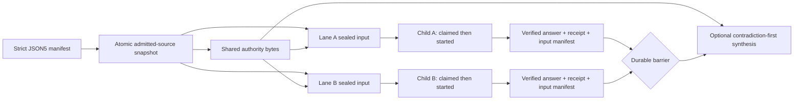

# Parallel consultation without rolling consensus

Batch Oracle is for one difficult decision that contains at least two
independent, decision-relevant questions. Each question becomes a declared
lane with its own mandate, falsification target, evidence, exact prompt, output
contract, and recoverable Oracle session. Oracle seals the complete first-stage
ready set before sending anything, dispatches those lanes concurrently up to
the owner's configured capacity, and keeps sibling answers hidden while the
stage is open. Recoverable work keeps the barrier open until its original
session is resumed or reaches a terminal state.

An optional synthesis lane starts only after the first-stage barrier closes. It
receives the raw answers and their provenance together, preserves dissent, and
adjudicates contradictions. Batch Oracle is not identical-prompt voting, a
persona panel, rolling synthesis, or an arbitrary workflow DAG.



## Manifest

Batch manifests are strict JSON or JSON5. Unknown fields, unsupported schema
versions, unsafe paths, lane ID collisions, exact normalized prompt duplicates,
and prompt/files/mandate duplicates fail validation. A batch requires at least
two first-stage lanes.

```json5
{
  schemaVersion: "oracle.batch.v1",
  slug: "release-readiness-tribunal",
  project: "example",
  objective: "Decide whether the release candidate is ready and identify one bounded next experiment.",
  cwd: ".",
  sharedAuthority: {
    revisionLabel: "release-candidate-4",
    files: ["docs/product-contract.md", "docs/release-criteria.md"],
  },
  policy: {
    maxParallel: 3,
    maxChildSessions: 4,
    allowanceGate: "pause-batch",
    partialSynthesis: "owner-explicit",
    revealLaneAnswersBeforeBarrier: false,
  },
  lanes: [
    {
      id: "contract",
      title: "Product contract",
      mandate: "Test the candidate against the declared user job and boundaries.",
      whyThisLane: "Feature completeness is independent from runtime reliability.",
      falsificationTarget: "The candidate can pass implementation checks while missing the declared job.",
      prompt: "Audit the release candidate against the product contract.",
      files: ["src/product/**", "tests/product/**"],
      bundleRole: "sources",
      outputContract: ["supported claims", "contract violations", "release blockers"],
    },
    {
      id: "recovery",
      title: "Recovery",
      mandate: "Test crash, detach, and retry behavior.",
      whyThisLane: "Durability requires different evidence from feature completeness.",
      falsificationTarget: "A passing foreground run hides duplicate-submit or lost-session risk.",
      prompt: "Audit recovery invariants and failure evidence.",
      files: ["src/session/**", "tests/recovery/**"],
      bundleRole: "evidence",
      outputContract: ["failure matrix", "duplicate-submit risks", "missing tests"],
    },
  ],
  synthesis: {
    id: "adjudication",
    title: "Release adjudication",
    prompt: "Reconcile the independent findings without voting by majority.",
    files: ["docs/release-criteria.md"],
    requiredOutput: ["contradiction matrix", "owner-pending decisions", "kill criteria"],
  },
}
```

Every file path or glob is resolved beneath the manifest's effective `cwd`.
Absolute paths, traversal, backslashes, empty path segments, and symlink escapes
are rejected. The resolved membership is copied once into a private staging
directory. Oracle hashes the copied bytes, writes the complete snapshot
manifest, and atomically publishes the directory before assembling any lane.
Every lane therefore sees the same shared-authority revision even if the
workspace changes during assembly. Later changes to an admitted workspace file
may set `admittedSourceDrift:true`; that name deliberately does not claim
detection of new files that would match an old glob. Drift never replaces the
snapshot or an already sealed child input.

## Commands

```bash
# Parse, validate, resolve files, and stop before browser/session creation.
oracle batch validate batch.json5

# Print the batch ID, seal all first-stage inputs, create all child mappings,
# and dispatch the ready set through the canonical dedicated CDP Pro lane.
oracle batch run batch.json5

# Inspect one reconciled parent or list recent batches.
oracle batch status <batch-id>
oracle batch status <batch-id> --json
oracle batch status --hours 168

# Reattach original recoverable sessions. This never duplicates a committed turn.
oracle batch resume <batch-id>

# Preserve the original session and record an explicit owner closure.
oracle batch accept-missing <batch-id> \
  --lane recovery \
  --reason "Reviewer exhausted without usable evidence."

# Cross the barrier after every unavailable lane has an owner decision.
oracle batch resume <batch-id> --allow-partial

# After bounded exact recovery, close an unavailable terminal synthesis.
oracle batch accept-missing <batch-id> \
  --synthesis \
  --reason "Committed synthesis remained nonterminal after bounded recovery."

# Summary hides raw child answers; load one or all only on demand.
oracle batch render <batch-id>
oracle batch render <batch-id> --lane recovery
oracle batch render <batch-id> --all
```

`--max-parallel` may lower the effective run capacity. It cannot raise the
manifest, local owner, or browser tab caps.

## Sealing, bundle identity, and privacy

All first-stage lanes must assemble successfully before Oracle creates any
child session or dispatches any prompt. Assembly reads only from the published
source snapshot. Each sealed lane records its batch/lane/role identity, source
snapshot digest, exact source membership, `prompt.txt` digest, exact attachment
set and bytes, token estimate, and a digest over the complete input manifest.
Dispatch and resume verify that whole chain. They do not re-glob or re-read the
mutable workspace.

Generated TXT and ZIP attachments have semantic identities such as:

```text
example--contract--sources--batch-a1b2c3d4--2c71e4a9.txt
example--recovery--evidence--batch-a1b2c3d4--d90a12f7.zip
example--adjudication--lane-answers--batch-a1b2c3d4--716eb620.zip
```

Bundle identity has three separate values:

- `sourceSetSha256` identifies the canonical label, role, and source-file set;
- `instanceId` scopes this concrete batch/session artifact so equal source sets
  from different consultations cannot collide; and
- `artifactSha256` hashes the final TXT/ZIP bytes exactly.

The filename contains the instance and the first eight source-set digest
characters. TXT headers and ZIP root manifests bind the readable identity and
source set. The exact final artifact digest is recorded beside the finished
artifact because a file cannot contain its own non-recursive hash. A
browser-added suffix such as ` (1)` may change the transported outer filename,
but not the internal source-set and instance identity.

The batch store is local and owner-only:

```text
~/.oracle/batches/<batch-id>/
├── manifest.source.json5
├── manifest.normalized.json
├── source-manifest.json
├── state.json
├── report.md
├── inputs/
│   ├── first-stage-seal.json
│   ├── source-snapshot/
│   │   ├── snapshot-manifest.json
│   │   └── <admitted source paths>
│   ├── lanes/<lane-id>/
│   └── synthesis/
└── outputs/
    ├── lanes/<lane-id>/answer.md + answer-receipt.json
    └── synthesis/answer.md + answer-receipt.json
```

Raw child answers are persisted as they arrive but are not printed during an
open stage. Each accepted answer is bound to its immutable receipt, child
session, input-manifest digest, byte length, and output digest. Synthesis and
`render --lane/--all` use the shared verified-answer reader; a mismatch blocks
consumption and leaves the original receipt untouched. The synthesis bundle
includes shared-authority bytes plus, for every completed lane, `answer.md`,
`answer-receipt.json`, and `input-manifest.json`. Rendering emits verified
answers in manifest order, never completion order.

## Recovery and owner gates

Each logical lane has one active recoverable attempt. Session creation and the
parent action claim are one atomic mutation. Immediately before a worker enters
browser dispatch, Oracle persists `dispatchStartedAt`. Quiet, detached, or
timed-out work reattaches to that lane's original child session. A new attempt
is allowed only during explicit `batch resume` when durable child evidence says
the previous prompt was unsubmitted, uncommitted, and `retrySafe:true`.
Committed, indeterminate, or recoverable submissions are never resubmitted. If
a worker entered dispatch but later has neither an explicit safe pre-submit
receipt nor a reattachable runtime, the attempt becomes `indeterminate` and the
batch stops at `awaiting-owner`.

The parent reconciles child metadata after a process interruption, including a
child session written before its parent mapping and an answer written before
the parent receipt. Orphan discovery accepts only the parent's sealed input
digest; mismatched digests, duplicate attempt numbers, or multiple possibly
committed children are an ambiguity error rather than “latest wins.” State
mutation locks are short-lived directory claims. Stale recovery uses an atomic
rename to quarantine the old claim, so concurrent reclaimers cannot both own
it. A newly created directory is protected during bounded owner-receipt
publication; an old empty directory remains reclaimable after that grace.
Locks are not held while GPT-5.6 Pro is thinking.

If ChatGPT raises a request-frequency gate before prompt commit, Oracle pauses
new lane starts and preserves already committed siblings. It reports the batch
and original session IDs. It does not loop Send, change transport, switch
provider/model/account, or use an API workaround.

An unavailable lane keeps the batch at `awaiting-owner`. It cannot be waived by
passing `--allow-partial` alone. The owner must first run `accept-missing` with a
lane ID and reason; Oracle preserves the original session/conversation, records
an `abandoned` terminal lane and durable owner decision, and never sends it
again. Only then may `resume --allow-partial` cross the barrier. The synthesis
prompt, receipts, report, and final `partial` status all name missing lanes and
weakened evidence.

Child sessions may be inspected by ID, but the Batch parent owns dispatch,
recovery, retry, completion, answer acceptance, barrier progression, and owner
closure. For a Batch child, **inspect** means reading stored status/metadata,
rendering its existing log and artifacts, or printing its paths. A plain
`oracle session <child-id>` attach is a one-shot read-only snapshot: it does not
wait, auto-reattach, repair a capture, write logs or artifacts, update a model
run or session status, or terminalize the child. Completed children remain
renderable.

Generic `session --live`, `session --harvest`, `--followup <child-id>`, and
`oracle restart <child-id>` fail closed for every Batch role, including an
owner-abandoned synthesis. Follow-up refusal happens before conversation URL
resolution; restart refusal happens before options are cloned or a new session
is created. Use `oracle batch resume <batch-id>` for recovery and completion,
and the parent `batch accept-missing` commands for owner closure. If an
independent consultation is genuinely needed, start a new ordinary Oracle run
instead of restarting the Batch lineage.

If first-stage evidence is complete but a committed synthesis remains
`recoverable`, `error`, or `indeterminate` after bounded exact recovery, the
owner may close only that synthesis with `accept-missing --synthesis --reason
<text>`. Oracle preserves the child session, conversation, attempts, and
receipts; marks synthesis `abandoned`; never sends it again; records the owner
reason in the report; and terminalizes the parent as `partial`. Verified raw
lane answers remain renderable. Because `partial` is terminal, the batch no
longer permanently protects its child sessions from the ordinary retention
policy.

Time-based session pruning is also fail-closed. If any batch state is unreadable,
Oracle refuses the pruning pass instead of assuming that no child is protected.

If the complete synthesis input exceeds the GPT-5.6 Pro context limit, Oracle
fails closed with per-answer sizes. It does not truncate answers or create a
hidden summary child.

## v1 boundary

Batch Oracle v1 supports one independent parallel stage plus one optional
synthesis stage. It does not add MCP tools, a TUI, YAML, API multi-model fanout,
OpenCLI batch dispatch, account-side quota probing, recursive batches, rolling
synthesis, or lane-to-lane dependencies. Use multiple declared batches when a
later stage genuinely depends on an earlier result.

See [CLI reference](cli-reference.md), [Configuration](configuration.md), and
[Sessions](sessions.md) for the corresponding command, local policy, and
lineage surfaces.
