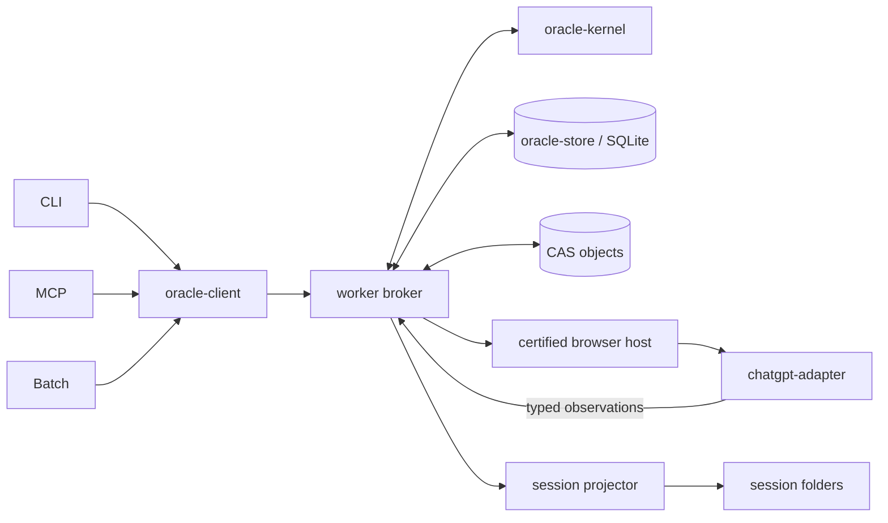

# Oracle v2 master plan

Status: accepted architecture and complete implementation coverage ledger

Repository baseline: `fork/main@e6f170ff` (2026-08-31)

Development line: `codex/oracle-v2`

## Goal and authority

Oracle v2 replaces invocation-owned browser execution with one durable local
job system:

> one worker, one SQLite ledger, one content-addressed object store, one
> certified persistent browser runtime, one ChatGPT adapter boundary, and one
> sealed textual bundle path.

The current direct-CDP engine remains the usable safety baseline until v2 has
passed its real canaries and an explicit default-switch decision. Except for a
P0/P1 safety, data-loss, duplicate-send, or current-user-blocking defect, v2
work must not extend or broadly refactor `src/browser/**`.

This plan is the authority for v2 scope and acceptance. Implementation details
may adapt to repository evidence, but any change to product scope, gate
ownership, retry authority, provider/model guarantees, or legacy retirement
must be recorded as a plan delta before implementation.

## Product boundary

The first canonical v2 lane is:

- a macOS GUI-session worker;
- ChatGPT web with GPT-5.6 Sol and Pro effort, verified independently;
- a text prompt or a text prompt plus one deterministic UTF-8 source bundle;
- exactly one external Send attempt per turn attempt;
- local CLI, MCP, and Batch clients;
- SQLite authority, CAS objects, and rebuildable session projections;
- recovery from client disconnect, worker crash, capture disconnect, and a
  committed conversation reopening;
- no automatic provider, model, account, runtime, or transport downgrade.

Deferred capabilities remain explicit legacy or secondary-engine features:
multiple independent attachments, inline/upload fallback, binary and media
review, ZIP ingestion, copy-profile, cookie sync, attach-running, arbitrary
remote Chrome, non-macOS browser workers, Deep Research, image generation,
Project Sources, Temporary Chat, automatic engine fallback, recursive Batch
DAGs, and a GUI/dashboard.

## Authority and dependency graph



Only the broker may append authority events and change durable job state.
Adapters return typed observations; browser processes, pages, targets, ports,
and PIDs are disposable execution resources and never durable job truth.

Workspace dependency direction:

```text
oracle-kernel
    ^
oracle-store      oracle-bundle      oracle-client
    ^                  ^                  ^
    +------------- oracle-worker --------+
                       ^
                chatgpt-adapter

root CLI / MCP / Batch -> oracle-client + oracle-bundle
```

`scripts/check-v2-boundaries.mjs` enforces the legacy-import and adapter
knowledge boundaries. Root CLI/MCP/Batch cutover enforcement becomes active in
R8; until then their legacy imports remain an explicit staged compatibility
path.

## Durable state contract

Jobs use explicit `(idempotencyScope, idempotencyKey)` uniqueness. Repeating a
key returns the existing job and never creates another Send. Similar content
may warn, but never authorizes automatic deduplication.

The durable states are:

```text
queued -> preparing -> ready-to-dispatch -> dispatch-reserved
       -> dispatch-at-risk -> committed -> capturing -> completed

pre-Send failures -> failed-unsent
committed capture failures -> recoverable(committed-capture)
verified unsent evidence -> recoverable(verified-unsent) -> failed-unsent
unknown effects after dispatch-at-risk -> ambiguous -> owner closure only
terminal owner closure -> canceled-unsent | abandoned
```

The reducer rejects every unlisted transition. Before the external action the
broker durably appends `dispatch-at-risk`; after that point the same attempt can
only prove commit, enter ambiguity, or prove unsent. It can never automatically
Send again.

Completion requires all of these bound to one turn attempt:

- preparation receipt with exact model/effort and, when required,
  composer-anchored bundle evidence;
- dispatch intent with prompt/bundle identity and pre-Send baseline;
- submission receipt with exact committed user turn and conversation identity;
- capture receipt with the assistant successor and completion evidence;
- answer object whose digest matches the receipt.

## Storage and protocol contract

`oracle-store` owns `node:sqlite`, migrations, transactional event+snapshot
updates, CAS references, projection rebuild, integrity checks, backups, and
retention. The worker is the sole writer. The local protocol is HTTP over an
owner-only Unix socket with object upload, job admission, status, sequenced
events, resume, abandon, worker status, and canary operations.

Session folders remain a stable readable projection. Adapter code never writes
them. Projection failure is recorded and retried without rolling back an
already committed external submission.

The scheduler uses one dispatch mutex and an initial capture concurrency of
three. Once a turn is committed and bound to a conversation, it releases the
dispatch mutex; committed conversations may then capture concurrently.

## Browser and provider contract

One G1 spike compares supported Playwright runtimes with fresh dedicated
profiles. Exactly one satisfying candidate becomes canonical. There is no
automatic runtime fallback. The selected profile is never a normal browser
profile and is owned by the worker's persistent context.

All ChatGPT selectors, locators, page evaluation, upload behavior, message
identity, completion detection, recovery, and UI fingerprinting live in
`packages/chatgpt-adapter`. A no-Send compatibility probe globally blocks new
dispatch when a mandatory capability is absent; it emits one provider incident
instead of one full DOM dump per queued job.

The canonical source input is either text-only or text plus one sealed textual
bundle. Bundle membership and bytes are deterministic. A bundle job cannot
reach dispatch readiness without composer-anchored exact artifact evidence,
and cannot complete without attachment evidence on the committed user turn.

## Programme sequence

| Slice    | Outcome                                                                                                  | Dependencies | Required evidence                                                         | Status      |
| -------- | -------------------------------------------------------------------------------------------------------- | ------------ | ------------------------------------------------------------------------- | ----------- |
| R0       | freeze boundary, public architecture authority, progress ledger, workspace skeleton, boundary checker    | baseline     | unchanged legacy tests; boundary check                                    | verified    |
| R1       | typed JobSpec/events/states/receipts, pure reducer, retry and owner policy, schema upcasting             | R0           | illegal-transition and completion-invariant tests                         | verified    |
| R2       | SQLite store, migrations, transactional append, explicit idempotency, CAS, projections, integrity/backup | R1           | crash consistency, duplicate admission, projection rebuild                | verified    |
| R3       | Unix-socket worker, singleton, scheduler, event stream, fake provider, client, restart recovery          | R1-R2        | client/worker kill recovery; bounded 1,000 fake jobs                      | in-progress |
| R4       | provider fixture, Playwright adapter, capability probe, UI fingerprint, test faults                      | R3           | 500 fixture jobs; all fault points; Send count at most one                | planned     |
| R5 / G1  | compare runtime candidates; owner login and runtime selection                                            | R4           | persistent login, cold restart, model/effort/upload/click stability       | owner-gated |
| R6       | real ChatGPT no-Send adapter probe and sanitized fixture capture                                         | G1           | compatibility receipt; no prompt submitted                                | planned     |
| R7 / G2  | text, bundle, and committed-capture-recovery live canaries                                               | R6           | exact model/effort/turn/bundle/conversation/capture receipts; one Send    | owner-gated |
| R8       | CLI and MCP v2 engine/cutover candidate; legacy remains default                                          | G2           | repeated reviews; client reconnect; MCP timeout retrieval                 | planned     |
| R9       | Batch lane/synthesis jobs preserve sealing, barrier, blind lanes, owner closure                          | R8           | restart/recoverable/accept-missing/synthesis Batch with no duplicate Send | planned     |
| R10 / G3 | make v2 the default browser engine; move legacy operations to advanced surface                           | R8-R9        | packed CLI, fixture/fault suite, stable-window evidence                   | owner-gated |
| R11      | remote bridge proxies durable objects/jobs/events/artifacts                                              | R10          | disconnect/idempotency/artifact transfer integration                      | planned     |
| R12 / G4 | retire legacy canonical execution; keep read-only session compatibility and rollback                     | R10-R11      | no canonical legacy imports; migration/read compatibility; rollback tag   | owner-gated |

G1 (runtime/login), G2 (first real Send), G3 (default switch), and G4
(legacy removal) are separate decisions. Source commits, installed runtime,
live browser acceptance, default activation, and legacy deletion are likewise
separate facts.

## Complete acceptance ledger

| ID  | Required outcome                                               | Owning slice | Verification                   | Status      |
| --- | -------------------------------------------------------------- | ------------ | ------------------------------ | ----------- |
| D01 | client exit does not stop an admitted job                      | R3           | worker integration             | planned     |
| D02 | duplicate idempotency key returns one job                      | R2-R3        | store/API integration          | in-progress |
| D03 | each turn attempt sends at most once                           | R1-R4        | reducer + fixture send counter | in-progress |
| D04 | hard exit after click cannot cause resend                      | R3-R4        | process fault injection        | planned     |
| D05 | committed job stays bound to its conversation                  | R1, R4, R7   | fixture and canary receipts    | in-progress |
| D06 | wrong-conversation navigation is rejected                      | R4           | fixture scenario               | planned     |
| D07 | bundle completion requires committed-turn attachment evidence  | R1, R4, R7   | reducer, fixture, canary       | in-progress |
| D08 | model and Pro effort have independent receipts                 | R1, R4, R7   | schema + fixture + canary      | in-progress |
| D09 | incompatible provider UI blocks before Send globally           | R3-R4        | compatibility incident test    | planned     |
| D10 | worker owns browser runtime without normal PID/port operations | R5-R7        | runtime and canary evidence    | owner-gated |
| D11 | CLI, MCP, and Batch use only the client protocol               | R8-R9        | boundary check + integration   | planned     |
| D12 | Batch sealing, barrier, and owner authority remain intact      | R9           | Batch integration              | planned     |
| D13 | session projections rebuild from DB/CAS                        | R2           | deletion/rebuild test          | verified    |
| D14 | debug objects obey TTL/cap/pinning                             | R2-R3        | retention tests                | in-progress |
| D15 | default output excludes forensic internals                     | R3, R8       | output tests                   | planned     |
| D16 | v2 page knowledge exists only in chatgpt-adapter               | R0, R4       | boundary check                 | in-progress |
| D17 | real canary receipts pass                                      | R7           | owner-authorized live canaries | owner-gated |
| D18 | fixture fault suite passes                                     | R4           | fixture/fault suite            | planned     |
| D19 | worker/browser/page soak has no continuing growth              | R4, R7-R10   | fixture and live soak          | planned     |
| D20 | canonical flow works with legacy engine disabled               | R12          | canonical E2E with legacy off  | owner-gated |

Full completion means every D01-D20 row is verified at its appropriate layer.
A green unit suite or finished tranche is not full v2 completion.

## Hard anti-spiral rules

- No new v2 capability in the legacy browser path.
- No v2 import from legacy browser code.
- No ChatGPT page knowledge outside the adapter package.
- No mixed-meaning evidence booleans; observations and receipts are typed.
- No adapter authority to write job state or session projections.
- No automatic Send after `dispatch-at-risk`.
- No implicit provider/model/account/runtime/transport switch.
- No second canonical bundle or attachment path.
- No second runtime before the first passes its long-running gate.
- No unit-test claim of real ChatGPT compatibility without a live canary.
- No normal workflow that requires PID, port, target, heal, or reconcile work.
- No default output of forensic internals.
- UI-drift fixes include a sanitized fixture, adapter test, and bounded canary.
- A tranche may change one primary authority boundary; cross-boundary changes
  are split into independently verifiable commits.

## Security, retention, and rollback

The database, objects, profile, and socket are owner-only. v2 performs no
cookie extraction or normal-profile copy, exposes no default TCP listener,
emits no telemetry, and excludes prompt/source bytes from default debug logs
and exports. Sanitized fixtures remove account and conversation data.

Authority receipts, job specifications, prompt/bundle/answer objects, owner
decisions, and Batch references follow session retention. Debug artifacts have
a 14-day default TTL, a 512 MiB cap, and unresolved-job pins. Idle daily SQLite
snapshots retain seven copies; integrity failure blocks Send and never triggers
an automatic destructive restore.

Until G3, rollback is selecting the unchanged legacy engine. Before G4, a
named rollback tag and read-only legacy-session compatibility are mandatory.
Legacy code is removed only after the canonical flow passes with legacy
execution disabled.

## Scope and order deltas

None. The plan preserves the accepted v2 product boundary, R0-R12 dependency
order, four owner gates, and D01-D20 acceptance set. File-level organization
may evolve without changing these contracts.
